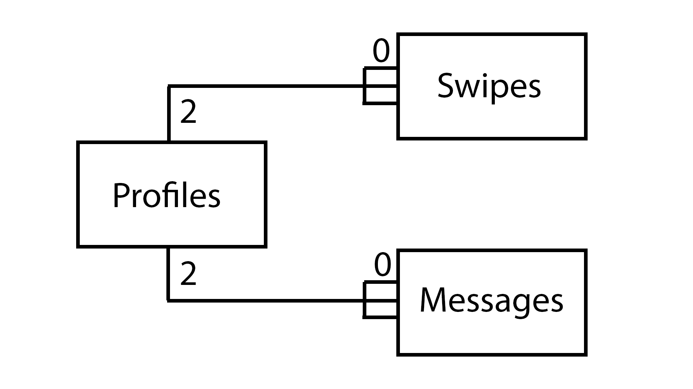

# Planering BrainySwipe - Hugo Lindström

## 1. Inledning

### 1.1 Kort beskrivning av projektet
Jag ska göra en datinghemsida med fokus på teknikelever.

### 1.2 Beskrivning av målgrupp
Extrema nördar. Kommer innehålla funktioner som bara otroligt stora nördar skulle kunna komma på att de behöver.

### 1.3 Betyg
A

## 2. Ingående beskrivning av projektet
### 2.1 Beskrivningen
Många kanske tycker att det är drygt med datingappar och datinghemsidor som inte har inbyggda kortkommandon samt ingen automatisk swiping. 
Jag vill göra en sida där man lätt kan skapa ett konto och börja dejta. Allting ska ha både kortkommandon och grafiska knappar samt så ska det finnas
en funktion som swipear alla till höger. Jag vill också lägga till en funktion som gör det långsamt att swipea vänster för att få fler att 
prata med varandra då man inte orkar säga nej. Ens profil kommer inte innehålla vanliga personuppgifter såsom om man har hund utan saker som 
favoritdel av fysik eller drömuniversitet. Chatfunktionen ska även innehålla en knapp som låter en slumpa mellan 100+ nördiga pick-up-lines.

### 2.2 Lista av saker som ska göras för att projektet ska bli till
#### 2.2.1 Frontend
* **Login** -> Formulär för att logga in / registrera
* **Logout** -> Du har nu loggat ut sida
* **Register** -> Kunna registrera sig
* **Dashboard** -> Man ska kunna se swipe-kort, help samt en gå till chat knapp
* **Chat** -> Man kan chatta med den som du och den andra har swipat höger.
* **Profile** -> Visa ens profil samt stats
* **Help** -> Visar alla kortkommandon

#### 2.2.2 Backend
* **Login samt logout** -> Cookie handler
* **Profile** -> Skapa profil, kryptera lösenord, ändra profil, visa stats
* **Chat** -> Kunna chatta med varandra
* **Swipea** -> Veta vem som swipeat vem samt autoswiper

#### 2.2.3 Databas
* **Profiler** -> ID, användarnamn, krypterat lösenord, samt alla olika personligheter med mera
* **Swipat** -> ID1, ID2, höger, vänster
* **Meddelanden** -> ID1, ID2, meddelande

### 2.3 Undersidor
* **Login** -> Formulär för att logga in
* **Logout** -> Du har nu loggat ut sida
* **Register** -> Formulär för att skapa konto
* **Profile** -> Du ska kunna se och modifiera din profil
* **Dashboard** -> Man ska kunna se swipe-kort, logga ut, se help, samt en gå till chat knapp
* **Chat** -> Man kan chatta med den som du och den andra har swipat höger

### 2.4 Moduler
* **Login** -> Kunna logga in
* **Logout** -> Kunna logga ut
* **Register** -> Kunna registrera sig
* **Cookies** -> Kunna behålla login
* **Profile** -> Kunna skapa, uppdatera, se status samt statistik
* **Swipe** -> Kunna swipa
* **Messages** -> Kunna ta emot samt skicka meddelanden
* **Server** -> Express server för att kunna göra GET, POST, DELETE och PUT requests

### 2.5 Databas
* **Profiles**  
    | ID(primary key)  | username  | password (Hashed with SHA-256) | name      | age | favorite_physics_field | dream_university |
    |------------------|-----------|--------------------------------|-----------|-----|------------------------|------------------|
    | INT32 (auto inc) | CHAR(100) | CHAR(100)                      | CHAR(100) | INT | CHAR(100)              | CHAR(100)        |
* **Messages**
    | ID(primary key)  | userID (secondary key) | content    |
    |------------------|------------------------|------------|
    | INT32 (auto inc) | INT                    | CHAR(1000) |
* **Swiped**
    | ID(primary key)  | user1ID (foreign key) | user2ID (foreign key) | swiped |
    |------------------|-----------------------|-----------------------|--------|
    | INT32 (auto inc) | INT                   | INT                   | BIT    |

### 2.6 Kunskaper
* **Fetch** -> Göra requests med fetch. [mozzila (fetch)](https://developer.mozilla.org/en-US/docs/Web/API/Fetch_API/Using_Fetch)
* **Cookies** -> Hur fungerar de? Hur sparar man data som går att validera? [w3schools (Cookies)](https://www.w3schools.com/js/js_cookies.asp)
* **Sessions** -> Hur fungerar de? Hur sparar man data som går att validera? [w3schools (Sessions)](https://www.w3schools.com/jsref/prop_win_sessionstorage.asp)
* **SHA-256 in js** -> Hur kan man kryptera lösenord på ett säkert sätt? [remarkable (Generating SHA-256 hash in Javascript](https://remarkablemark.medium.com/how-to-generate-a-sha-256-hash-with-javascript-d3b2696382fd)
* **Koppla js till MYSQL** -> Hur kopplar man ihop de? [w3schools (node.js MYSQL)](https://www.w3schools.com/nodejs/nodejs_mysql.asp)

### 2.7 Säkerhet
* **Lönsenord** -> Jag kommer använda mig utav SHA-256 för att kryptera lösenord så att man inte kan se klartext i databasen.
* **SQL injection** -> Jag kommer med största sannolikhet behöva sanitera data eller liknande
* **XSS (Cross site scripting)** -> Jag kommer med största sannolikhet behöva sanitera data eller liknande

## 3. Tidsplanering - Deadlines
* Server - 31/3
* Dashboard-frontend - 31/3
* Login-frontend - 1/4
* Logout-frontend - 1/4
* Register-frontend - 1/4
* Profile-frontend - 1/4
* Chat-frontend - 2/4
* Login-backend - 3/4
* Logout-backend - 3/4
* Register-backend - 1/4
* Profile-backend - 3/4
* Login-databas - 3/4
* Logout-databas - 3/4
* Profile-databas - 3/4
* Swipe-backend - 5/4
* Chat-backend - 6/4
* Keybinds - 8/4

## 4. Dokumentation
* **31/2 - 1/4** Klar med front-end för dashboarden samt kan hosta en server. När jag gjorde swipe-funktionen för mina kort upptäckte jag att
man kunde trycka flera gånger i rad på knapparna. Detta ledde till att man swipade flera kort i taget. För att fixa det stängde jag av knapparna
under ett antal sekunder medans korted swipades. Jag hade också problem med att skicka JSON via GET-requests. För att lösa detta läste jag på lite
så att jag förstod vad det var jag behövde göra. Som slutlösning använde jag mig utav async och await samt .then().
