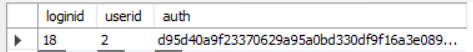
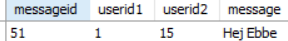
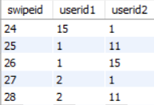

# Planering BrainySwipe - Hugo Lindström

## 1. Inledning

### 1.1 Kort beskrivning av projektet
Jag ska göra en datinghemsida med fokus på teknikelever.

### 1.2 Beskrivning av målgrupp
Extrema nördar. Kommer innehålla funktioner som bara otroligt stora nördar skulle kunna komma på att de behöver.

### 1.3 Betyg
A

## 2. Ingående beskrivning av projektet
### 2.1 Beskrivningen
Många kanske tycker att det är drygt med datingappar och datinghemsidor som inte har inbyggda kortkommandon samt ingen automatisk swiping. 
Jag vill göra en sida där man lätt kan skapa ett konto och börja dejta. Allting ska ha både kortkommandon och grafiska knappar samt så ska det finnas
en funktion som swipear alla till höger. Jag vill också lägga till en funktion som gör det långsamt att swipea vänster för att få fler att 
prata med varandra då man inte orkar säga nej. Ens profil kommer inte innehålla vanliga personuppgifter såsom om man har hund utan saker som 
favoritdel av fysik eller drömuniversitet. Chatfunktionen ska även innehålla en knapp som låter en slumpa mellan 100+ nördiga pick-up-lines.

### 2.2 Lista av saker som ska göras för att projektet ska bli till
#### 2.2.1 Frontend
* **Login** -> Formulär för att logga in / registrera
* **Logout** -> Du har nu loggat ut sida
* **Register** -> Kunna registrera sig
* **Dashboard** -> Man ska kunna se swipe-kort, help samt en gå till chat knapp
* **Chat** -> Man kan chatta med den som du och den andra har swipat höger.
* **Profile** -> Visa ens profil samt stats
* **Help** -> Visar alla kortkommandon

#### 2.2.2 Backend
* **Login samt logout** -> Cookie handler
* **Profile** -> Skapa profil, kryptera lösenord, ändra profil, visa stats
* **Chat** -> Kunna chatta med varandra
* **Swipea** -> Veta vem som swipeat vem samt autoswiper

#### 2.2.3 Databas
* **Profiler** -> ID, användarnamn, krypterat lösenord, samt alla olika personligheter med mera
* **Swipat** -> ID1, ID2, höger, vänster
* **Meddelanden** -> ID1, ID2, meddelande

### 2.3 Undersidor
* **Login** -> Formulär för att logga in
* **Logout** -> Du har nu loggat ut sida
* **Register** -> Formulär för att skapa konto
* **Profile** -> Du ska kunna se och modifiera din profil
* **Dashboard** -> Man ska kunna se swipe-kort, logga ut, se help, samt en gå till chat knapp
* **Chat** -> Man kan chatta med den som du och den andra har swipat höger

### 2.4 Moduler
* **Login** -> Kunna logga in
* **Logout** -> Kunna logga ut
* **Register** -> Kunna registrera sig
* **Cookies** -> Kunna behålla login
* **Profile** -> Kunna skapa, uppdatera, se status samt statistik
* **Swipe** -> Kunna swipa
* **Messages** -> Kunna ta emot samt skicka meddelanden
* **Server** -> Express server för att kunna göra GET, POST, DELETE och PUT requests

### 2.5 Databas
* **Profiles**  
    | ID(primary key)  | username  | password (Hashed with SHA-256) | name      | age | favorite_physics_field | dream_university |
    |------------------|-----------|--------------------------------|-----------|-----|------------------------|------------------|
    | INT32 (auto inc) | CHAR(100) | CHAR(100)                      | CHAR(100) | INT | CHAR(100)              | CHAR(100)        |
* **Messages**
    | ID(primary key)  | userID (secondary key) | content    |
    |------------------|------------------------|------------|
    | INT32 (auto inc) | INT                    | CHAR(1000) |
* **Swiped**
    | ID(primary key)  | user1ID (foreign key) | user2ID (foreign key) | swiped |
    |------------------|-----------------------|-----------------------|--------|
    | INT32 (auto inc) | INT                   | INT                   | BIT    |

* 

### 2.6 Kunskaper
* **Fetch** -> Göra requests med fetch. [mozzila (fetch)](https://developer.mozilla.org/en-US/docs/Web/API/Fetch_API/Using_Fetch)
* **Cookies** -> Hur fungerar de? Hur sparar man data som går att validera? [w3schools (Cookies)](https://www.w3schools.com/js/js_cookies.asp)
* **Sessions** -> Hur fungerar de? Hur sparar man data som går att validera? [w3schools (Sessions)](https://www.w3schools.com/jsref/prop_win_sessionstorage.asp)
* **SHA-256 in js** -> Hur kan man kryptera lösenord på ett säkert sätt? [remarkable (Generating SHA-256 hash in Javascript](https://remarkablemark.medium.com/how-to-generate-a-sha-256-hash-with-javascript-d3b2696382fd)
* **Koppla js till MYSQL** -> Hur kopplar man ihop de? [w3schools (node.js MYSQL)](https://www.w3schools.com/nodejs/nodejs_mysql.asp)

### 2.7 Säkerhet
* **Lösenord** -> Jag kommer använda mig utav SHA-256 för att kryptera lösenord så att man inte kan se klartext i databasen.
* **SQL injection** -> Jag kommer med största sannolikhet behöva sanera data eller liknande
* **XSS (Cross site scripting)** -> Jag kommer med största sannolikhet behöva sanera data eller liknande

## 3. Tidsplanering - Deadlines
* Server - 31/3
* Dashboard-frontend - 31/3
* Login-frontend - 1/4
* Logout-frontend - 1/4
* Register-frontend - 2/4
* Profile-frontend - 2/4
* Chat-frontend - 2/4
* Login-backend - 3/4
* Logout-backend - 3/4
* Register-backend - 3/4
* Profile-backend - 3/4
* Chat-backend - 6/4
* Swipe-backend - 5/4
* Login-databas - 4/4
* Logout-databas - 4/4
* Profile-databas - 4/4
* Chat-databas - 6/4
* Swipe-databas - 5/4
* Keybinds - 8/4

## 4. Dokumentation
### 4.1 Vad har jag gjort, vilka problem har uppstått
* **31/3 - 1/4** Klar med front-end för dashboarden samt kan hosta en server. När jag gjorde swipe-funktionen för mina kort upptäckte jag att
man kunde trycka flera gånger i rad på knapparna. Detta ledde till att man swipade flera kort i taget. För att fixa det stängde jag av knapparna
under ett antal sekunder medans korted swipades. Jag hade också problem med att skicka JSON via GET-requests. För att lösa detta läste jag på lite
så att jag förstod vad det var jag behövde göra. Som slutlösning använde jag mig utav async och await samt .then().

* **1/4 - 2/4** Klar med front-end för login, logout, register samt profile. Hade inte så många problem den här gången.
* **2/4 - 3/4** Klar med front-end för chat
* **19/4** Klar med backend för login samt logout
* **20/4** Klar med register-backend
* **1/5** Klar med profile-backend samt chat-backend
* **8/5** Klar med swipe-backend
* **10/5** Klar med login-databas. Hade problem med att jag inte kunde skicka databasen requests. Löste det genom att använda pool istället för connect.
* **10/5** Klar med logout-databas
* **10/5** Klar med profile-databas
* **11/5** Klar med register-databas samt chat-databas
* **17/5** Klar med swipes-databas

### 4.2 Utvärdering
Min planering fungerade ganska bra. Det största problemet var att jag hade planerat in för mycket. Jag hann till exempel inte med att lägga till hotkeys till hemsidan.
Jag hade också problem med "fetch" funktionen som jag tänkte använda i början av projektet. Jag lyckades inte skicka data. Jag löste detta genom att använda mig av forms med requests on submit
samt Jquerys $.post(). I början av projektet trodde jag att jag skulle kunna använda mig utav express's static hosting. Detta gick inte då jag behövde kolla att användaren var inloggad innan
jag skickade tillbaka sidan. För att lösa detta routade jag manuellt genom att ge varje HTML-fil varsin url. Jag tänkte först att jag skulle göra klart projektet snabbt. Detta hände inte.
Databasen ser inte riktigt ut som jag tänkt i planeringen. Det första jag ändrade var att man kan swipea vänster på folk hur många gånger som helst.
Hemsidan är gjord så att det ska vara så jobbigt att swipea vänster som möjligt. Genom att man påminns om personen om och om igen swipear användaren höger någon gång.
Jag lade även till en tabell, login. Detta för att jag insåg hur authentication med cookies fungerade.

### 4.3 Testning
#### 4.3.1 Personer
* **Farmor**: "Jag förstår inte vad man ska ha den till"
* **Casper**: "Hugos hemisda är väldigt cool 😎"
* **Oskar**: "Den kommer hjälpa min få flera fruar, det är coolt att man kan skriva med folk och det är coola anmimationer"
* **Oliver**: "Auto pick up line grejen är kul"
* **Elias**: "Den är häpnadsväckande"
* **Ben**: "Det är jobbigt att swipen till vänster går så långsamt"

#### 4.3.2 Testning i webbläsare
Fungerar i Firefox, chrome, brave, safari samt opera GX.

### 4.4 Upphovsrätt och GDPR
Jag använder inga bilder som jag tagit från internet. För att regristrera sig måste man klicka i rutan "Accept Cookies". Detta är allt jag behöver göra då jag inte tar någon mer information
från användaren samt jag inte använder några bilder jag tagit från internet.

### 4.5 Koden
Koden består av tre huvudsakliga delar, frontend, backend samt servern.

#### 4.5.1 Frontend
Frontenden består av HTML samt css. All css är skriven i scss och sedan kompilerad ner till en stor CSS-fil. Jag använder mig av SCSS istället för CSS eftersom scss gör det lättare att dela 
upp koden i filer, har stöd för variabler samt kan nästa block. CSS har stöd för variabler, men bara i root medan SCSS kan ha de överallt. SCSS kan dessutom nästa block. Detta gör syntaxen
lättare att förstå när man till exempel vill att något ska hända endast om dess förälder har en viss klass.

HTML-koden använder sig av forms. Forms gör det lätt att skicka information från många olika element i en requests via body.
Genom att sätta "name" attributen kan man ta emot requesten och läsa av innehållet av ett element genom `req.body[name]` där name är värdet av name attributen hos HTML-elementet.
Att använda sig av en form ger också möjligheten att klicka på enter för att skicka medelandet, logga in med mera.

#### 4.5.2 Backend
Backend består av två JS filer, chat.js samt cards.js.

#### 4.5.2.1 chat.js
Chat.js tar hand om allt som har med chat-funktionen och göra. Chat.js är scriptet som läser in informationen från servern om alla meddelanden användaren har fått 
samt användare som användaren kan prata med. Chat.js ser även till att ta bort alla potentiella taggar från meddelanden för att minimera risken för XSS.
Chat.js har också hand om auto-pickupline funktionen. Den väljer bara en random pickupline från en lista och sätter värdet av meddelandet den ska skicka till pickuplinen.

#### 4.5.2.2 cards.js
cards.js är både frontend och backend. Detta eftersom den både skapar och animerar kort, men även tar in information från servern.

#### 4.5.3 Server
Servern består av en del funktioner. Huvudfunktionen är att skicka information till användaren. Detta gör den genom express.static samt app.get(). 
express.static hostar static mappen. I static mappen ligger filer som inte spelar någon roll om användaren är inloggad eller inte.
app.get() använder jag för att kunna gå mellan requesten och responsen. De sidor som inte ska kunna laddas om man inte är inloggade kan inte vara
static hostade, då laddas de automatiskt. Istället säger man, "Om en request kommer hit, kolla om användaren är inloggad först".
Om användaren är inloggad kommer sidan laddas, annars skickar man login-sidan. app.get() kan användas för mer än att bara skicka sidor, till exempel
använder jag det för att skicka JSON-data.

Servern använder sig även av app.post() för att man ska kunna ladda upp information på sidan.

Servern är även sidan som använder sig av SQL-kopplingen. SQL-databasen kopplas till hemsidan via mysql.createPool().
Poolen gör så att jag kan skicka många saker till databasen samtidigt.

Servern har även en funktion som heter "hash()". hash() är en funktion som bildar en sha-256 hash av lösenord så att lösenordet inte står med klartext
i databasen. Hash funktinoen används också för att skapa authentication-tokens så att man kan logga in.
Hash är en matematisk funktion som bara fungerar åt en hållet. Detta gör att man inte kan räkna ut vad lösenordet borde vara, utan man måste gissa sig fram.
Om lösenordet är bra nog är detta inte möjligt då man skulle behöva göra så pass många gissningar att det skulle ta för lång tid.

### 4.6 Databasen
Databasen jag har använt är MYSQL. Jag har skapat ett schema som heter `brainyswipe`.
I schemat har jag fyra tabeller, `accounts`, `login`, `messages` samt `swipes`.

#### 4.6.1 Accounts
Accounts är en tabell som innehåller informationen om alla användare. Varje användare har ID, firstName, lastName, age, username, passwordHash 
samt användarens fpf (favorite physics field). 
ID är en primärnyckel. Ett problem med denna databas är att flera användare kan ha samma användarnamn. Detta leder till att
fler än en person kan läsa meddelande. Detta beror på att meddelanden använder användarnamn istället för ID. För att fixa det kan man använda ID för att 
särskilja användare eller så kan man göra så att bara en person kan ha ett användarnamn.

#### 4.6.2 Login
Login tabellen innehåller tre kolumner, ID, userID samt auth. ID är primärnyckeln, userID är den inloggades användarID, auth är en 
athentication-token som användaren bär som cookie. Cookien jämförs senare med varje authentication-token för att se om den tillhör någon inloggad
och vem.

#### 4.6.3 Messages
Messages är en tabell som innehåller ett ID, ett userID1, ett userID2 samt ett message. ID är för varsitt meddelande, userID1 är för användaren som skickade
meddelandet, userID2 är för användaren som tog emot meddelandet och message är innehållet av meddelandet.

#### 4.6.4 Swipes
Swipes tabellen innehåller tre kolumner, ID, userID1 och userID2. userID1 är den som swipeade höger och userID2 är den som blev swipead.
Denna tabell är också den som bestämmer vilka användare som kan skicka meddelanden till varandra.
Om båda personerna (userID1 och userID2) har swipeat varandra till höger kommer de kunna skicka varandra meddelanden.

### 4.7 Källor
Jag har inte använt mig av någon annan tutorial än de som finns i planeringsdelen.

### 4.8 Säkerhet
Koden är inte helt säker. Till exempel är SQL injection en möjlighet. Dock har inte jag lyckats komma igenom. Chat funktionen är inte heller sårbar mot xss
då jag tar bort alla taggar. Lösenorden är krypterade med SHA-256. Detta betyder att det inte går att räkna ut vad lösenordet är. Det går fortfarande att 
gissa sig fram dock, men så länge lösenordet är bra nog från användarens sida blir detta svårt.

### 4.9 Betyg
Mit projekt tar med databaser på några olika sätt. Projektet använder sig av en express-server som använder sig av både en statisk mapp samt en del egenkonstruerade URLs.
Detta har jag gjort för att kunna gå emellan requesten och kolla om användren är inloggad. Jag använder mig även av forms för att skicka requests samt cookies för att loggas in,
vilket vi inte har gått igenom hur man använder.

Jag tycker jag förtjänar ett B då jag har gjort saker vi inte nödvändigtvis har fått reda på hur vi ska göra.
